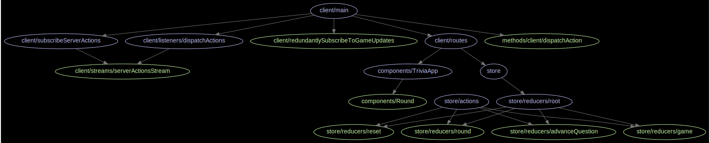
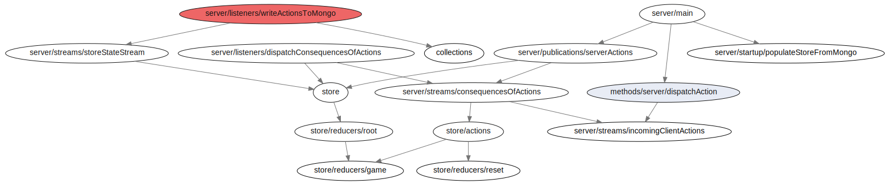

# meteor-trivia

An event-driven web application and client, whose events pass through a Redux store, emitting a stream of states, which change a persistent store (DOM, or DB) regularly.

That stream of states is subscribed to by a difference engine, which calculates when, and how to update the persistent store.

Both the web application and its client publish a stream of events for the other side to observe.

# Client Design


# Server Design


# Redux Architecture


# Getting started

* `npm run` - to view a list of tasks
* `.githooks/pre-commit/quality.sh` - see the githooks that police commits

# What can you do with it?

This 2 line diff allows us to defer mongo writes for 1 second, while still retaining the responsiveness of our application to other clients.

```diff
-storeStateStream.bufferWithCount(2, 1).subscribe(buffer => {
+storeStateStream.bufferWithCount(2, 1).subscribe(buffer => Meteor.setTimeout(() =>{
   let [oldState, newState] = buffer
   updateMongo(singletonId, diff(oldState, newState))
-})
+}, 1000)
```


# References
- [RxJS](http://reactivex.io/) - a cross-platform stream-based library
- [ImmutableJS](https://facebook.github.io/immutable-js/) - a nice object manipulation library
- [Redux](http://redux.js.org/) 
- [Redux-Act](https://github.com/pauldijou/redux-act)

